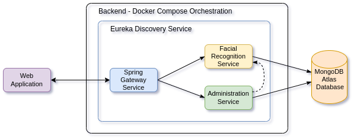

# Trabajo de integración curricular

Este repositorio es el resultado del trabajo de integración curricular de los estudiantes de la Escuela Politécnica Nacional del Ecuador, de la Facultad de Ingeniería de Sistemas, para la obtención del título de `Ingeniero/a en Ciencias de la Computación`. El trabajo consiste en la creación de un prototipo de sistema de reconocimiento facial. 

El sistema se compone de frontend, backend y base de datos.

## Tabla de Contenidos

- [Autores](#autores)
- [Arquitectura](#arquitectura)
- [Módulos](#módulos)
  - [Backend](#backend)
    - [Microservicio Eureka Discovery](#microservicio-eureka-discovery)
    - [Microservicio Spring Gateway](#microservicio-spring-gateway)
    - [Microservicio de Administración](#microservicio-de-administración)
    - [Microservicio de Reconocimiento Facial 1](#microservicio-de-reconocimiento-facial-1)
    - [Microservicio de Reconocimiento Facial 2](#microservicio-de-reconocimiento-facial-2)
  - [Frontend](#frontend)
  - [Base de Datos](#base-de-datos)

## Objetivo general del prototipo del sistema

Crear un prototipo de sistema de reconocimiento facial que permita identificar a las personas que se encuentran en una base de datos. El sistema es capaz de comparar una imagen cargada con las imágenes almacenadas en la base de datos y devolver el mejor resultado si existe una coincidencia.

## Autores

- [Adhisson Cedeño](https://github.com/adhisson89)
- [Mireya Ramírez](https://github.com/Ivonne-Ramirez)
- [Daniela Román](https://github.com/danielaro2)
- [Verónica Zúñiga](https://github.com/Verolu)

## Arquitectura
La arquitectura del prototipo del sistema sigue el siguiente diagrama:

## Módulos

El trabajo se dividió en componententes individuales que al juntarse crean el sistema completo según la arquitectura.

### Backend

Para el Backend, se creo un sistema de microservicios orquestados por docker compose

#### [Microservicio Eureka Discovery](./administration-service/README.md)

Este microservicio es el servidor de descubrimiento que permite a los microservicios registrarse y descubrirse entre sí dinámicamente.

#### [Microservicio Spring Gateway](./spring-gateway-service/README.md)

Este microservicio es el encargado de enrutar las peticiones a los microservicios que se encuentran en la red. Para ello, se utiliza el servidor de descubrimiento Eureka.

#### [Microservicio de Administración](./administration-service/README.md)

Este microservicio se encarga de la administración de la aplicación. Registra administradores, permite el inicio de sesión, un CRUD de las personas a las que va a identificar el sistema.

#### [Microservicio de Reconocimiento Facial 1](./backend/model-service/README.md)

#### [Microservicio de Reconocimiento Facial 2](./backend/deepface-service/README.md)

### Frontend
Para el Frontend, se crearon dos aplicaciones web, una para el prototipo de la EPN (Escuela Politécnica Nacional) y otra para la PNE (Policía Nacional del Ecuador).

#### [Frontend EPN](./frontend-epn/README.md)

#### [Frontend PNE](./frontend-pne/README.md)

### Base de Datos

La base de datos fue desplegada en Mongo Atlas, un servicio de base de datos en la nube. Para que el sistema funcione, en el asegurarse de que la base este correctamente configurada y accesible. Si solo se desea probar el sistema, se puede crear una base de datos local con docker en los mismos archivos del proyecto.

